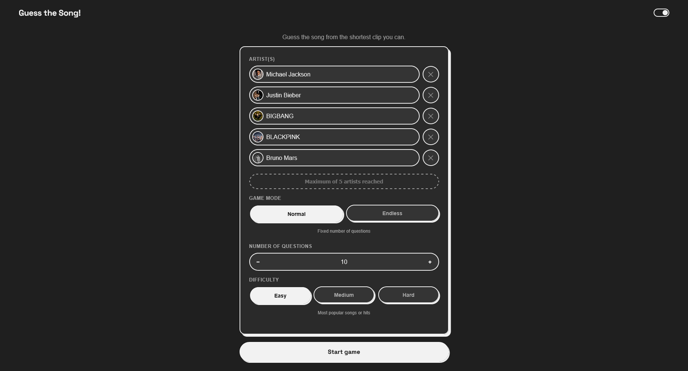

# Guess the Song! — [Play → https://albertbenedict.github.io/guess-the-song/](https://albertbenedict.github.io/guess-the-song/)

A song-guessing game: pick 1–5 artists, guess from the shortest clip you can (0.1s → 10s).

## Running it
1. VS Code → `File > Open Folder...` → this folder
2. Install **Live Server** → right-click `index.html` → **Open with Live Server**
3. Opens at `http://localhost:5500` — or just use the Play link above.

## Features
- **Modes:** Normal (3–30 Q, stepper) / Endless (∞ until fail, best run in `localStorage`)
- **Difficulty:** Easy (hits only) / Medium (65% hits) / Hard (all) — hit = top ~20% iTunes relevance (heuristic, not charts)
- **Staged reveals:** 0.1s / 0.5s / 2s / 5s / 10s → 500 / 400 / 300 / 200 / 100 pts. Wrong guess → auto-reveal longer clip. Cover art shown on reveal.
- **UX:** 5 artists max (`+ Add` → `Maximum of 5 reached`), light/dark theme (portfolio vars), 640px centered, iOS 16px anti-zoom + `touch-action: manipulation` + hover only on mouse.

## How to play
1. Type artist → pick from dropdown (`PLAY` badge). Avatar swaps iTunes → YouTube `- Topic` if available.
2. Pick mode/difficulty → **Start game**
3. Tap disc to hear clip → type guess (autocomplete from pool) → **Guess** or **Skip / reveal more**
4. After correct / `10s` reveal, **Guess hides, Next moves up** → `View score` on last Q.

## Tech
- Vanilla `index.html / style.css / script.js` — no build, `?v=12` cache-bust.
- **Audio:** `Web Audio AudioBufferSource.start(0, offset, duration)` for true 0.1s (iOS-unlocked sync in click, `AudioContext` + `GainNode` fade 1.5s), `<audio>` fallback. `stopAudio()` + `audioLoadToken` fixes spam Skip/Next race.
- **APIs:** iTunes `search / lookup?entity=song&limit=200` (`previewUrl` 30s, `artworkUrl100`) unlimited + YouTube Data v3 `search?type=channel&q=Artist - Topic` (100/day, `Map` cached, top-row thumbnail upgrade + avatar upgrade, referrer-restricted `https://albertbenedict.github.io/*`).
- **Layout:** `.app` wraps all screens, `6px` sticker card, 5 breakpoints.

## Files
- `index.html` — structure, `.app` nesting (fixed)
- `style.css` — portfolio theme, responsive + `hover: hover` wrapper
- `script.js` — pools/bags, `Web Audio`, artist/YouTube fetch

## Known limits
- 30s iTunes previews only; `- Topic` requires artist has auto-generated YouTube channel.
- YouTube quota 100 fresh artists/day (cached repeats free).
